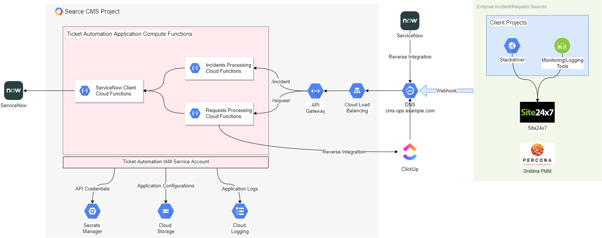

# Servicenow Incident and Request Automation

## Description

This tool is designed to connect various incident and request sources with ServiceNow ITSM tool. Currently it supports ClickUp, Site24x7, Grafana PMM and Stackdriver as source of incidents/requests. Previosly mentioned tools/services provide in built functionalities to integrate with ServiceNow but this application was desgined to fulfill specific requirements to process tickets (incidents/requests) before creating it in ServiceNow. It supports reverse integration as well which allows to update integrated tools based on the changes in ServiceNow tickets. It leverages GCP's serverless services to reduce costs and infrastructure management. Some of the GCP services which are used include Cloud Functions for processing ticket payload, API Gateway and Cloud LoadBalancing for API endpoint management, Secrets Manager for storing API credentials and Cloud Storage for storing application configurations. Following diagram shows the overall architecture of the application.



## Information Flow

- API Gateway along with Cloud LoadBalancing exposes the endpoint through which various tools can integrate with the application via webhook.
- Integrated tools POST the ticket payload to the endpoint on a specific path based on nature of the ticket (incident/request).
- Each Cloud Function listens at a particular path (configured through API Gateway).
- Cloud Function, either Incident Processing or Request Processing Function based on the ticket type, processes the ticket payload and POSTs it to ServiceNow Client Function which then upserts it in ServiceNow.
- For reverse integration, based on Business Rules in ServiceNow, API Gateway webhook is triggered which then triggers the necessary function.

## Application Structure

### Currently there are 3 main functions in the application which are also depicted in the arch diagram:

1. ServiceNow Client Function
2. Incident Processing Function
3. Request Processing Function

### 1. ServiceNow Client Function

This function deals with making necessary API calls to the ServiceNow instance based on the requests it recieves from other functions. It is not exposed through API Gateway and only accepts requests from authorised functions only. This kind of restriction is there due to reason that ServiceNow Client Function uses admin level API crendentials.

All the requests made to ServiceNow Client are POST requests and the request configurations are passed in a JSON body. Following is the format of the JSON body:

```json
{
    "method": "(str) POST/PUT/QUERY/GET/DELETE",
    "api_path": "(str) SERVICENOW_API_PATH (e.g. api/now/table/incident)",
    "request_headers": "(dict) REQUEST_HEADERS",
    "query_parameters": "(dict) QUERY_PARAMETERS/SYSPARM",
    "request_body": "(dict) REQUEST_BODY_JSON"
}
```

### 2. Incident Processing Function

This function processes the incident payloads received from various monitoring/alerting tools via the API Gateway. It processes the incident and before POSTing it to the ServiceNow Client, it first checks whether same incident is open/active in ServiceNow which is also done through ServiceNow Client Function as only the later function has access to ServiceNow API. If the incident is already there in ServiceNow with active/open status, instead of creating a new ticket in ServiceNow incident table, it appends a work note in the existing open/active ticket.

A ticket from each monitoring tool belongs to a single python class. Currently the tool supports 3 monitoring tools each represented by a single class:

- Site24x7
- Stackdriver
- Grafana PMM

Each class consists of the following methods:

- addRequest - To load the incident payload
- getIncidentDetails - To parse required details from the incident payload
- getIncidentState - To get the incident state from ServiceNow if same kind of incident ticket exists. It basically calls the ServiceNow Client Function to achieve this.
- actOnIncident - To upsert the incident in ServiceNow based on the incident state. It basically calls the ServiceNow Client Function to achieve this.

### 3. Request Processing Function

This function processes the request payloads received from various CMS tools via the API Gateway. It processes the request and before POSTing it to the ServiceNow Client, it first checks whether same request is open/active in ServiceNow which is also done through ServiceNow Client Function as only the later function has access to ServiceNow API. If the request ticket is already there in ServiceNow with active/open status, instead of creating a new ticket in ServiceNow, it appends a work note in the existing open/active ticket.

A ticket from each monitoring tool belongs to a single python class. Currently the tool supports only one source of request tickets which is:

- ClickUp Tasks

The class representing a ClickUp Task ticket consists of the following methods:

- addRequest - To load the incident payload
- getRequestDetails - To parse required details from the request payload
- getRequestState - To get the request state from ServiceNow if same kind of request ticket exists. It basically calls the ServiceNow Client Function to achieve this.
- actOnRequest - To upsert the request in ServiceNow based on the request ticket state. It basically calls the ServiceNow Client Function to achieve this.

## Application Source

Source code of each function of the application is contained in a single directory which is present in `source` directory from repository root:

- `source\servicenow_function` - ServiceNow Client Function Source
- `source\incident_processing_function` - Incident Processing Function Source
- `source\request_processing_function` - Request Processing Function Source
    
Each of the above functions is deployed in a sperate Cloud Function.

## Application Deployment

### Environment Setup

- Configure Service Account for Cloud Functions and API Gateway:
    - `ticket-automation-sa@PROJECT_ID.iam.gserviceaccount.com` - Single Service Account for all the Cloud Functions (you can also use seperate Service Accounts for different Cloud Functions). It is through this Service Account that a Cloud Function accesses application configurations from Cloud Storage and API credentials from Secrets Manager.
    - `api-gateway-sa@PROJECT_ID.iam.gserviceaccount.com` - Service Account used by the API Gateway to invoke the Cloud Functions.

- Create API Credential Secrets in Secrets Manager:
    - The credentials must be uploaded in JSON and the format is mentioned in `secret.json.sample` file in each Function's directory where required.

- Upload Application Configurations:
    - For each Function, its configuration is stored in Cloud Storage and the format of the configuration JSON file is mentioned in `config.json.sample` file in each Function's directory.

- Grant following roles to `ticket-automation-sa@PROJECT_ID.iam.gserviceaccount.com` Service Account so that it can access the secret and configuration files in the Cloud Storage:
    - Secret Manager Secret Accessor role on the configured secrets
    - Storage Legacy Object Reader role on the GCS Bucket where the configuration files are stored. You can also grant object level ACLs to restrict access on all the object in the bucket

- Deploy all the Functions with the following configurations:
    - Source - `source/FUNCTION_SOURCE_DIR`
    - Runtime Environment Variables - `BUCKET_NAME=CONFIG_STORAGE_BUCKET`, `SOURCE_BLOB_NAME=PATH_OF_FUNCTION_CONFIG_FILE_IN_THE_BUCKET`

- Grant necessary roles to Service Accounts to invoke required Cloud Functions:
    - Grant Functions Invoker role to `ticket-automation-sa@PROJECT_ID.iam.gserviceaccount.com` on ServiceNow Client Function
    - Grant Functions Invoker role to `api-gateway-sa@PROJECT_ID.iam.gserviceaccount.com` on Incident Processing and Request Processing Functions

- Follow the steps given in `infrastructure/api_gateway/deployment_steps.txt` to deploy API Gateway and Backend Service for the API Gateway.

- Configuring Global HTTP/S Load Balancer for the Backend Service configured in the above step.

## Cost Implications

### The application uses following cost incurring services:

| Service                                                                        | Is Cost Centre? |
|--------------------------------------------------------------------------------|-----------------|
| [Cloud Functions](https://cloud.google.com/functions/pricing)                  | Yes             |
| [API Gateway](https://cloud.google.com/api-gateway/pricing)                    | Yes             |
| [Global HTTP/S Load Balancer](https://cloud.google.com/vpc/network-pricing#lb) | Yes             |
| [Cloud Storage](https://cloud.google.com/storage/pricing)                      | No              |
| [Secrets Manager](https://cloud.google.com/secret-manager/pricing)             | No              |

Click on the Service to get the pricing details.